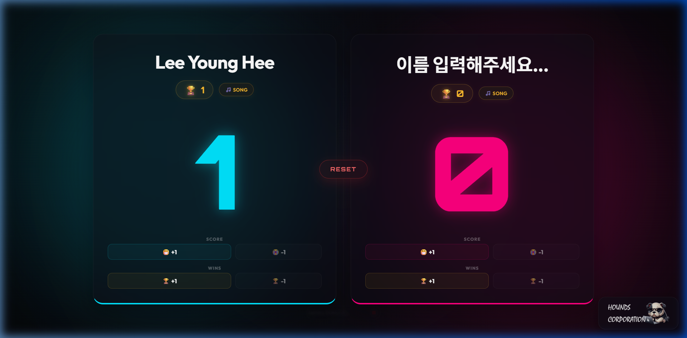

# 🎮 Weekend-ScoreBoard (보드게임 점수판)

> 여자친구와 보드게임할 때 사용하려고 취미로 가볍게 만든 프리미엄 네온 테마 디지털 점수판 (Vanilla HTML, CSS, Javascript)

Weekend-ScoreBoard는 여자친구와 보드게임할 때 쓰려고 가볍게 제작한 점수판입니다. 플레이어 이름을 직접 수정해서 사용할 수 있고(새로고침해도 이름과 세트 스코어가 유지됩니다), 세트 승리 시 재생되는 축하 음악을 각자 원하는 곡으로 등록해서 사용할 수 있습니다.

---

## 🎵 기본 승리 음악 설정 방법 (친절 가이드)

선수가 세트를 승리했을 때 재생될 기본 배경 음악을 세팅하는 방법은 매우 간단합니다:

1. 준비하신 음원 파일(MP3, WAV, M4A 등)의 이름을 대소문자를 구분하여 정확히 **`VICTORY.mp3`**로 변경합니다.
2. `ScoreBoard.html` 파일이 들어있는 **동일한 폴더(루트 경로)**에 변경한 **`VICTORY.mp3`** 파일을 그냥 넣어두기만 하면 됩니다.

별도의 작업 없이 프로그램이 폴더 안의 해당 파일을 스스로 인지하여 기본 승리 축가로 매핑해 줍니다.

> [!TIP]
> **무음 예외 처리**: 만약 폴더 내에 `VICTORY.mp3` 파일이 없거나 브라우저에서 재생 오류가 발생하더라도, 투박한 에러창을 띄우지 않고 자동으로 감지하여 소리 없이 조용히 Now Playing 위젯을 닫아 대시보드 화면을 깔끔하게 지켜줍니다.

---

## 🚀 사용 방법

1. **저장소를 클론**하거나 소스 파일을 다운로드합니다.
2. 디폴트 음악으로 쓸 **`VICTORY.mp3`** 파일을 루트 폴더에 넣어줍니다 (선택 사항).
3. **`ScoreBoard.html` 파일을 더블 클릭**하여 선호하는 브라우저(크롬, 사파리, 엣지 등)로 실행합니다. (로컬 서버 구동이 필요 없습니다!)
4. **선수 이름 설정**: 각 카드의 플레이어 이름을 클릭하여 원하는 이름으로 변경해 줍니다 (예: 홍길동, 임꺽정 등).
5. **점수 및 세트 관리**:
   - 큰 **`+1`** 버튼을 누르면 점수(SCORE) 또는 세트(WINS)가 1점 올라가며 통통 튀는 모션 애니메이션이 실행됩니다.
   - 실수로 올린 경우 우측의 작은 **`-1`** 버튼으로 점수를 줄일 수 있습니다.
6. **선수 개인 전용 곡 올리기**: 각 카드 내 트로피 배지 우측의 `🎵 SONG` 버튼을 클릭하여 본인만의 개별 MP3 응원가를 저장할 수 있습니다.
7. **초기화**: 중앙의 빨간색 `RESET` 버튼을 누르면 세트 스코어와 커스텀 이름을 보존한 상태로 현재 경기 점수만 `0`으로 즉시 안전하게 리셋해 줍니다.

